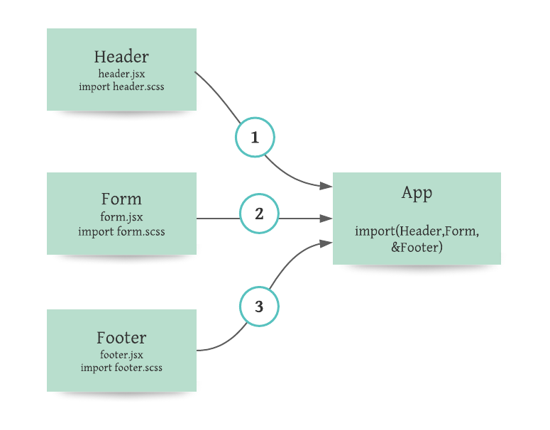

# *RESTy*

It's an API testing tool that can be run in any browser, allowing a user to easily interact with APIs in a familiar interface. 

### *Author: Tamara Alrashed* 
 

### *Run the App*

  *`npm start`*  

Runs the app in the development mode.\
Open [http://localhost:3000](http://localhost:3000) to view it in the browser.

### *UML*
 

